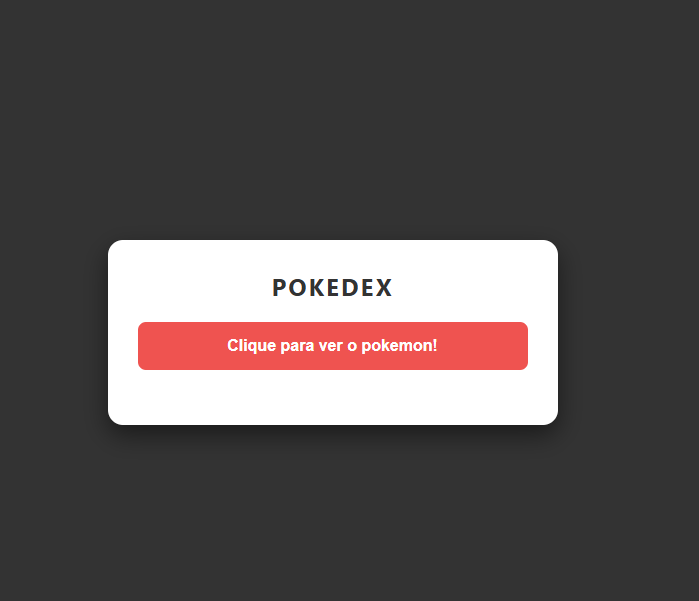
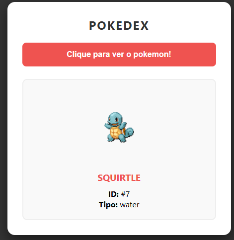

# Consumindo-APi-Pokemon Pokédex Aleatória (Primeira Geração)

Uma aplicação web leve e responsiva que utiliza a [PokeAPI](https://pokeapi.co/) para sortear e exibir informações detalhadas dos 151 Pokémons originais.

---

## 🚀 Funcionalidades

- **Sorteio Aleatório:** Algoritmo que seleciona um ID entre 1 e 151.
- **Consumo de API:** Uso de Fetch API com async/await para busca de dados em tempo real.
- **Tratamento de Erros:** Mensagens de feedback visual enquanto o Pokémon é carregado ou em caso de falha na rede.
- **Interface Responsiva:** Design adaptável para diferentes tamanhos de tela.

---

## 🛠️ Tecnologias Utilizadas

| Tecnologia      | Descrição                                              |
|-----------------|-------------------------------------------------------|
| HTML5           | Estrutura semântica do projeto                        |
| CSS3            | Estilização e layout (Flexbox/Grid)                   |
| JavaScript (ES6)| Lógica de sorteio, consumo de API e manipulação do DOM|
| PokeAPI         | Fonte de dados RESTful para informações dos Pokémons  |

---

## 📦 Como Instalar e Rodar

Para testar o projeto localmente, siga os passos abaixo:

1. **Clone o repositório:**
   ```bash
   git clone hhttps://github.com/IsackOtavio/Consumindo-APi-Pokemon.git
   ```

2. **Acesse a pasta:**
   ```bash
   cd Consumindo-APi-Pokemon
   ```

3. **Inicie o projeto:**
   Basta abrir o arquivo `index.html` em seu navegador de preferência ou utilizar a extensão Live Server no VS Code.

---

## 💻 Visualização do Código Principal

A lógica principal utiliza o conceito de Programação Assíncrona para garantir que a interface não trave enquanto os dados são buscados:

```js
async function buscarPokemon() {
    // ... lógica de sorteio
    const resposta = await fetch(url);
    const dados = await resposta.json();
    exibirPokemon(dados);
}
```

---

## 🎨 Demonstração

> **

Apois clicar ele consome da PokeApi um pokemon aleatorio:

---
## 🔗 Link do Projeto

> ###  [Acesse a Pokédex Aleatória aqui!](https://consumindoapipokemon.netlify.app)


## ✒️ Autor

Desenvolvido com ☕ por **Isack Otávio Vasconcelos Souza**.